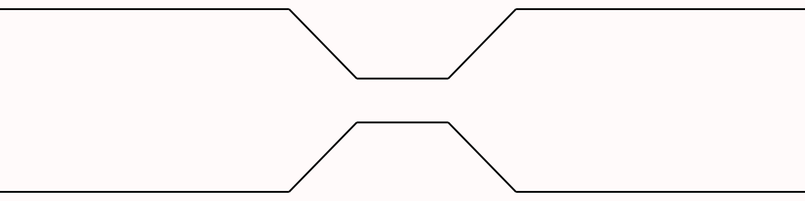
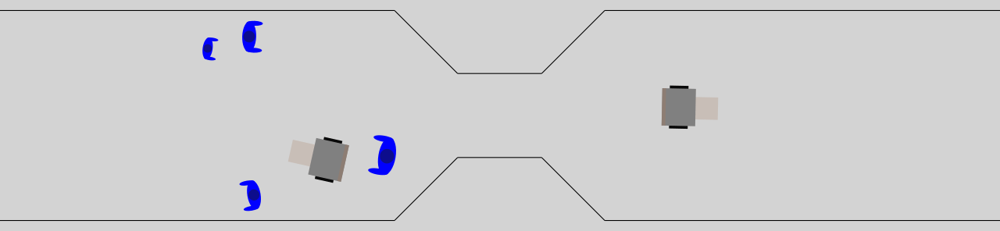
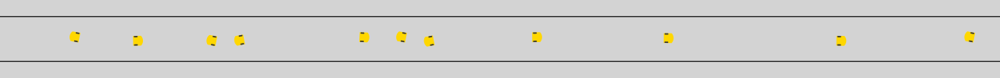

# navground_narrow

This repository contains navground components that
explore navigation in  narrow spaces.

## Installation

First, install `navground` following the [instructions](https://idsia-robotics.github.io/navground/latest/installation).

Build this package using `colcon`

```console
$ colcon build --packages-select navground_narrow
```

or install directly using Python

```console
$ python setup.py install
```

To check if it has been installed correctly, run

```console
$ navground_py plugins
...
navground_narrow
----------------
Modulations: FollowLeader [Python], Narrow [Python]
Scenarios: CorridorWithNarrowPassage [Python]
...
```

## Components

### `CorridorWithNarrowPassage` scenario

```console
$ navground_py info --scenarios NarrowingCorridor --properties --description 
Installed components
====================
Scenarios
---------
NarrowingCorridor
    add_modulation: False (bool)
      Whether to add a Narrow behavior modulation to all agents
    add_safety_to_agent_margin: True (bool)
      Whether to add the safety margin to the agent margin
    agent_margin: 0.10000000149011612 (float)
      The agent margin
    bidirectional: True (bool)
      Whether the traffic in the corridor in bi-directional
    length: 10.0 (float)
      The length of the corridor
    narrow_length: 2.0 (float)
      The length of the narrow passage
    narrow_width: 2.0 (float)
      The width of the narrow passage
    width: 1.0 (float)
      The width of the corridor
```

Defines a bi-directional corridor with a narrow passage in the middle where agents may get stuck.



### `FollowLeader` behavior modulation

```console
$ navground_py info --modulations Lane --properties --description
Installed components
====================
Modulations
-----------
Lane
```

A behavior modulation that discourages agents to overtake, making them forming lanes of flow.

### `Narrow` behavior modulation

```console
$ navground_py info --modulations Narrow --properties --description
Installed components
====================
Modulations
-----------
Narrow
```

A behavior modulation that adds obstacles at the entrance of a narrow passage, avoiding the agents to enter, when this would result in a blockage.

## Examples

The `example` directory contains configurations and videos from two scenarios.

- In `narrow_passage.yaml`, the agents travel along a a corridor with a narrow passage in the middle where they may get stuck. Depending on the random seed, they agent do (odd seeds) or do not (even seeds) use the `Narrow` behavior modulation.

  ```console
  $ navground_py record_video examples/narrow_passage.yaml narrow_passage_with_modulation.mp4 --factor 10 --seed 1 --width 1280
  ```

  


- In `narrow_corridor.yaml`,  the agents travel with individual preferred speeds along a narrow corridor, where they may get stuck. Depending on the random seed, they agent do (odd seeds) or do not (even seeds) use the `FollowLeader` behavior modulation.

  ```console
  $ navground_py record_video examples/narrow_corridor.yaml narrow_corridor_with_modulation.mp4 --factor 10 --seed 1 --width 1280
  ```

  


## Acknowledgement and disclaimer

The work was supported in part by [REXASI-PRO](https://rexasi-pro.spindoxlabs.com) H-EU project, call HORIZON-CL4-2021-HUMAN-01-01, Grant agreement no. 101070028.


The work has been partially funded by the European Union. Views and opinions expressed are however those of the author(s) only and do not necessarily reflect those of the European Union or the European Commission. Neither the European Union nor the European Commission can be held responsible for them.

